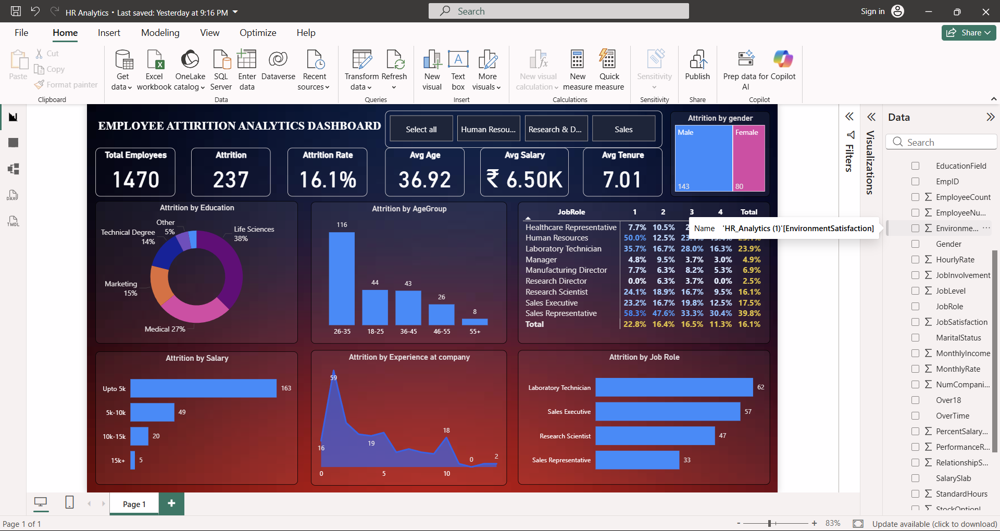

# 📊 Employee Attrition Analytics Dashboard | Power BI

## 📌 Project Overview

This project presents an **interactive Employee Attrition Analytics Dashboard** developed using **Microsoft Power BI**. The dashboard provides valuable insights into workforce demographics, employee turnover trends, job satisfaction, salary distribution, and departmental attrition patterns.

The objective of this project is to transform HR data into meaningful visualizations that help organizations understand employee attrition and make data-driven workforce management decisions.

---

## 🚀 Dashboard Preview

---

## 🎯 Objectives

* Analyze overall employee attrition trends.
* Monitor workforce demographics and key HR metrics.
* Identify departments and job roles with high attrition.
* Evaluate the impact of salary and job satisfaction on employee turnover.
* Understand attrition patterns across age groups and education fields.
* Support HR decision-making through interactive visualizations.

---

## 📈 Key Performance Indicators (KPIs)

| Metric             | Value       |
| ------------------ | ----------- |
| 👥 Total Employees | 1470        |
| 🚪 Attrition Count | 237         |
| 📉 Attrition Rate  | 16.1%       |
| 🎂 Average Age     | 36.92 Years |
| 💰 Average Salary  | ₹6.50K      |
| ⏳ Average Tenure   | 7.01 Years  |

---

## 📊 Dashboard Features

### 1️⃣ Attrition Analysis by Education

Analyzes employee attrition across educational backgrounds.

**Insights:**

* Life Sciences contributes the highest attrition percentage.
* Medical and Marketing backgrounds also show significant turnover.
* Technical Degree holders account for a notable share of attrition.

---

### 2️⃣ Attrition Analysis by Age Group

Displays employee attrition across different age categories.

**Insights:**

* Employees aged 26–35 show the highest attrition.
* Younger employees are more likely to leave the organization.
* Attrition decreases in higher age groups.

---

### 3️⃣ Attrition by Gender

Visualizes attrition distribution between male and female employees.

**Insights:**

* Male employees account for a larger portion of attrition.
* Gender-based analysis helps identify workforce retention trends.

---

### 4️⃣ Job Satisfaction Analysis

Evaluates attrition rates based on job satisfaction levels across job roles.

**Insights:**

* Lower job satisfaction levels are associated with higher attrition.
* Sales Representatives and Human Resources show elevated attrition rates.

---

### 5️⃣ Attrition by Salary

Analyzes employee turnover across salary brackets.

**Salary Categories:**

* Up to 5K
* 5K–10K
* 10K–15K
* 15K+

**Insights:**

* Employees earning below 5K experience the highest attrition.
* Attrition decreases as salary levels increase.

---

### 6️⃣ Attrition by Experience at Company

Tracks employee attrition based on years spent in the organization.

**Insights:**

* Most attrition occurs during the initial years of employment.
* Long-term employees demonstrate higher retention.

---

### 7️⃣ Attrition by Job Role

Highlights job roles with the highest employee turnover.

**Top Job Roles:**

* Laboratory Technician
* Sales Executive
* Research Scientist
* Sales Representative

**Insights:**

* Technical and sales-related roles experience the highest attrition.
* These positions may require focused retention strategies.

---

## 🛠️ Tech Stack

| Tool             | Purpose                        |
| ---------------- | ------------------------------ |
| Power BI Desktop | Dashboard Development          |
| Power Query      | Data Cleaning & Transformation |
| DAX              | Calculated Measures & KPIs     |
| Data Modeling    | Relationship Management        |
| Excel / CSV      | Data Source                    |

---

## 📂 Dataset Information

The dataset includes the following attributes:

* Employee ID
* Age
* Gender
* Department
* Education Field
* Job Role
* Monthly Income
* Job Satisfaction
* Years at Company
* Attrition Status
* Performance Rating
* Marital Status
* Overtime

---

## 🔄 Interactive Features

### Department Filter

Users can filter data using:

* Human Resources
* Research & Development
* Sales

### Cross Filtering

Selecting any chart automatically filters related visuals across the dashboard.

### Dynamic Analysis

Provides flexible exploration of employee attrition and workforce trends through interactive visualizations.

---

## 💡 Business Insights

* The overall employee attrition rate is **16.1%**.
* Employees aged **26–35 years** show the highest turnover.
* Lower salary groups are more likely to leave the organization.
* Life Sciences employees contribute the highest attrition percentage.
* Laboratory Technicians and Sales Executives experience significant turnover.
* Early-stage employees are at greater risk of attrition.
* Job satisfaction has a direct impact on employee retention.

---

## 📁 Repository Structure

Employee-Attrition-Analytics-Dashboard/
│
├── HR_Analytics.pbix
├── HR_Employee_Attrition.xlsx
├── Dashboard.png
├── README.md

---

## 📸 Screenshots

### Main Dashboard

---

## 🎓 Skills Demonstrated

* Data Cleaning
* Data Transformation
* Data Modeling
* DAX Calculations
* KPI Development
* Dashboard Design
* Data Visualization
* Human Resource Analytics
* Business Intelligence
* Analytical Thinking

---

## 📈 Future Enhancements

* Employee Attrition Prediction using Machine Learning
* Workforce Retention Forecasting
* Employee Performance Analytics
* HR Recruitment Analytics
* Real-Time Dashboard Integration
* Advanced Drill-Through Reports

---

## 👨‍💻 Author

**Rajan Kumar**

Aspiring Data Analyst | Power BI Developer

🔗 LinkedIn: https://linkedin.com/in/rajan-kumar263

🔗 GitHub: https://github.com/Rajan263

---

### ⭐ If you found this project useful, don't forget to star the repository.
